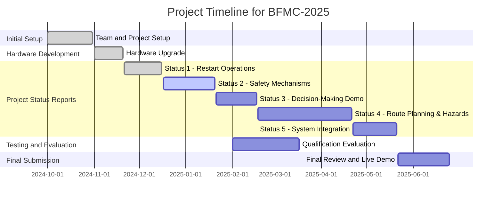

# Project Plan: LH-CDC [Vienam - 2025]

# Project Title: Advancing Autonomous Vehicle Systems and Safety Innovations for BFMC-2025

### **Team Members:**
- **Team Name:** LH-CDC  
- Bui Minh Cuong - Leader  
- Dương Hoai Phong - Member  
- Tran Thi Ngoc Thao - Member
- Dao Quoc Huy - Member  

---

### **1. Objectives**
- Enhance hardware performance and ensure smooth vehicle operation, focusing on optimizing battery efficiency and overall system performance.
- Prioritize safety and stability, placing the highest importance on maintaining secure and reliable system operations at all times.
- Develop advanced autonomous driving capabilities, emphasizing decision-making, route planning, and robust safety mechanisms to handle unexpected hazardous scenarios effectively.

---

### **2. Products to be completed and delivered**
1. **Project status report**: Status 1, 2, 3,4,5.
2. **Video submission**: Update project results and development process.
3. **GitHub repository**: Comprehensive documentation and latest source code updates.
---

### **3. Milestones**

| **Milestone**        | **Description**                                              | **Deadline**       | **Status**       |
|----------------------|------------------------------------------------------------|--------------------|------------------|
| Initial Setup        | Team and project setup                                     | 10/31/2024         | Completed        |
| Hardware Upgrade     | Enhance hardware and optimize system performance           | 11/20/2024         | Completed        |
| Project Status 1     | Restart vehicle operations and upgrade lane handling       | 12/16/2024         | Completed        |
| Project Status 2     | Develop and establish safety mechanisms and priorities for vehicle actions    | 01/20/2025         | Pending          |
| Project Status 3     | Demonstrate basic autonomous decision-making capabilities  | 02/17/2025         | Pending          |
| Qualifications   | Evaluate progress towards goals and refine roadmap, deploy testing activities for safety handling tasks        | 03/17/2025         | Pending          |
| Project Status 4     | Demonstrate advanced route planning and hazard handling, tunnel crossing and predictive handling of potential hazards in the tunnel    | 04/21/2025         | Pending          |
| Project Status 5     | Complete system integration, vehicle operation and autonomy tasks, safety and contingency handling and reporting           | 05/21/2025         | Pending          |
| Final Submission     | Complete project review and live demonstration             | 06/25/2025         | Pending          |

---

### **4. Key Tasks**

#### **Task 1: Video Processing and Submission**  
- Finalize video edits incorporating feedback to meet quality standards.  
- Upload the processed video to YouTube and ensure proper metadata for evaluation.  

#### **Task 2: Report Preparation and Delivery**  
- Revise and enhance project reports with updated progress details.  
- Submit the finalized reports on GitHub with comprehensive documentation.  

#### **Task 3: Team Coordination and Communication**  
- Conduct regular team meetings to monitor progress and resolve issues promptly.  
- Maintain consistent communication with organizers to seek clarifications, gain approvals, and address any concerns.  

---  

### **5. Timeline**

---

### **6. Risks and Mitigation**

| **Risk**                                  | **Impact**      | **Mitigation Strategy**                                           |
|-------------------------------------------|-----------------|-------------------------------------------------------------------|
| Delayed submissions                       | High            | Establish early deadlines, regular checks, and buffer timelines. |
| Technical challenges                      | Medium          | Leverage team expertise, seek external support, and prototype in stages. |
| Communication issues                      | Medium          | Set clear communication protocols, use collaborative tools, and hold regular meetings. |
| Resource limitations                      | High            | Secure additional funding, establish partnerships, and optimize resource allocation. |
| Integration challenges during system testing | High         | Implement incremental testing and debugging, maintain detailed documentation. |
| Hardware failure                          | High            | Keep spare components, perform routine maintenance, and stress-test hardware. |
| Software bugs                             | Medium          | Conduct rigorous testing, use version control, and establish a bug-tracking system. |
| Insufficient data for autonomous driving  | Medium          | Gather diverse datasets, simulate scenarios, and test in controlled environments. |
| Unexpected environmental conditions       | High            | Develop adaptive algorithms, conduct tests in varied conditions, and implement contingency plans. |
| Team member availability                  | Medium          | Cross-train team members, maintain flexible schedules, and plan for redundancies. |
| Safety mechanism failure                  | High            | Perform thorough validation, prioritize safety features, and implement fail-safe protocols. |

---

### **7. Note**
- **File Compliance**: Ensure all submitted files strictly adhere to size limits and format specifications to avoid disqualification.
- **Thorough Verification**: Double-check all uploaded files for completeness and accuracy prior to final submission, including appropriate links, descriptions, and metadata.
- **Progress Tracking**: Maintain consistent tracking of tasks and milestones; report any issues or delays immediately for timely resolution.
- **Collaboration**: Promote regular communication within the team to align goals and address concerns promptly.
- **Backup Plan**: Always back up critical files and components to minimize the risk of data loss or system failure.

---

### **8. Contact Information**
- **Team Leader**: Bui Minh Cuong - LH-CDC
- **Email**: ngoctuanvinh1332@gmail.com
- **Phone**: +84 365 646 109  

---
